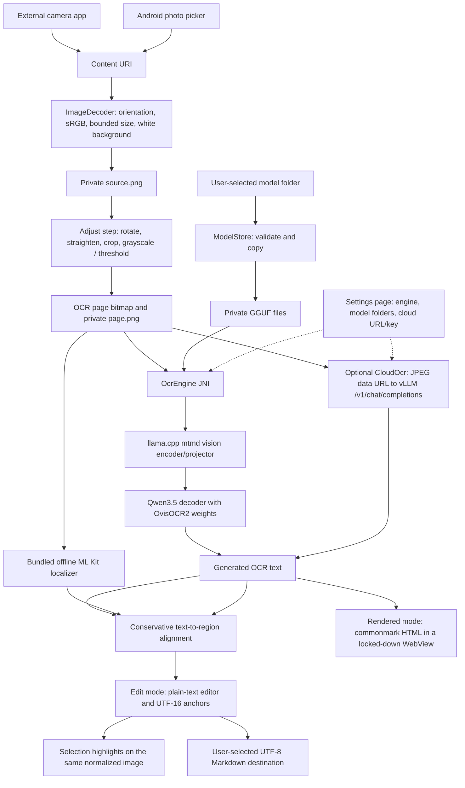

# OCRDroid architecture

## Scope and current acceptance boundary

OCRDroid is an Android API 33+ application that transcribes a single image
locally using the open-weight **ATH-MaaS/OvisOCR2** model. The default deployment
uses a Q4_K_M language model and an F16 vision encoder/projector. A BF16 language
model is an optional, user-imported alternative. An optional **cloud engine**
sends the page to a user-operated vLLM server through the OpenAI chat completions
API; it is off unless the user selects it.

Actual Q4 and BF16 generation has passed on Android API 33 x86_64 emulators.
Both ARM64 and x86_64 native binaries compile, and the APK's offline import,
inference, localization, editing, rotation, and export flow has passed Android
instrumentation. **Physical ARM64 performance, thermals, battery use, and
reliability on a phone with more than 6 GB RAM remain unverified.** There is no
registered device runner. Compiling ARM64 is not treated as executing on ARM64.

Download and installation instructions are in [README.md](README.md).

## Runtime data flow



OvisOCR2 produces all displayed transcription. ML Kit's recognized text is used
only to align source-image regions; it does not replace or silently correct the
OvisOCR2 result. There is no HTTP inference service or Python runtime inside the
APK. The on-device engines never open network connections; INTERNET permission
exists only for the optional cloud engine (see the trade-offs below).

## Components

| Component | Responsibility |
| --- | --- |
| `MainActivity` | Material navigation drawer; three-step scan workflow (choose image, adjust, side-by-side image and output panels); Rendered/Edit toggle; selection callbacks |
| `Edits` | Pure-Java preprocessing state and maths: quarter turns, straighten angle, crop fractions of the rotated frame, colour matrices, Otsu threshold |
| `PageEditor` / `CropView` | Renders edits onto a white canvas (shared by preview and output); interactive crop frame with live rotated and filtered preview |
| `Ui` | Helpers for the code-built Material 3 widgets (cards, buttons, toolbar, theme colours) |
| `OcrViewModel` | Retained scan state, engine dispatch (local JNI or cloud), progress/error messages, cancellation, and export |
| `SettingsActivity` / `SettingsViewModel` | Model settings page: engine choice, folder import/removal, cloud URL/model/key, connection test, highlight language |
| `AppSettings` | SharedPreferences-backed configuration; API key encrypted with an AndroidKeyStore AES-GCM key |
| `CloudOcr` | OpenAI-compatible client: endpoint normalization, request/response format, error detail, size limits, cancellation |
| `Markdown` | commonmark (+GFM tables) to sanitized HTML with a restrictive CSP; figure boxes replaced by local image crops |
| `Work` | Shared executors: one serializes model import/removal and inference, one handles I/O and connection tests |
| `ImageFiles` | Content-URI decoding, EXIF orientation, sRGB conversion, longest-edge limit of 2048 pixels, transparency compositing, PNG normalization |
| `ModelStore` | Manifest validation, size/storage checks, SHA-256 verification, GGUF headers, private weight copies, per-precision selection |
| `OcrEngine` and `native\jni.cpp` | Java/native boundary, cancellation flag, native error propagation, UTF-8 result transfer |
| `native\ocr.cpp` | Shared CPU inference implementation: model load, vision processing, prompt evaluation, greedy decoding, truncation and memory/time reporting |
| `native\probe.cpp` | Standalone Android executable using the same inference core; emits text and metrics for CI |
| `Localizer` | Runs the selected bundled ML Kit script recognizer on the normalized bitmap and obtains line rectangles |
| `TextAnchors` | Aligns generated text to line rectangles and maintains UTF-16 offsets through edits |
| `Viewport` | Pure-Java zoom/pan state (zoom 1–10×, centre in content coordinates, clamped offsets, focus targets); unit tested on the JVM |
| `DocumentView` | Fits the OCR page, or the kept original with the OCR region outlined, to the view and applies the same transform to highlighted rectangles |
| `SelectionEditor` | Reports selection changes from the editable plain-text field |

The sources live under `app\src\main\java\io\github\ocrdroid` and `native`.
Tests are under `app\src\test`, `app\src\androidTest`, and `scripts`.

## Model preparation and compatibility

### Pinned inputs

`runtime.lock.json` records the exact Hugging Face model revision, llama.cpp
commit, default quantization, projector format, and MTP exclusion. The exporter
downloads that revision rather than silently following the model's latest files.
The application embeds the model/runtime revision identifiers in `BuildConfig`.

The model architecture is `Qwen3_5ForConditionalGeneration`, not an older
Ovis-specific Android runtime. llama.cpp supports its language architecture and
the corresponding vision processing through `mtmd`. This avoids embedding the
publisher's server-oriented vLLM/Python stack on a phone.

### Conversion pipeline

```text
Pinned OvisOCR2 Hugging Face weights
  -> language GGUF in BF16, with --no-mtp
  -> optional Q4_K_M quantization of the language GGUF
  -> matching vision encoder/projector GGUF in F16
  -> manifest with revision pins, filenames, byte sizes and SHA-256 hashes
  -> downloadable folder ZIP, including the model license
```

The inherited model configuration advertises an MTP/speculative draft layer
whose tensors are absent from the published checkpoint. Without `--no-mtp`, the
converted metadata causes llama.cpp to look for missing `blk.24` tensors.
Excluding the unused speculative head fixes loading without changing the
ordinary OCR decoder or patching upstream runtime code.

Q4_K_M is a **mixed 4-bit quantization scheme**, not a guarantee that every tensor
has exactly four bits. The vision encoder/projector remains F16 in both profiles.
Consequently, the optional "BF16" setting means BF16 language weights plus an F16
vision component, not an entirely BF16 pipeline.

Raw `model.safetensors` folders are not accepted by the application. Conversion
happens in GitHub Actions; the phone only imports prepared GGUF bundles.

### Import and storage contract

A bundle contains `manifest.json`, the selected language GGUF, `mmproj-f16.gguf`,
and the model license. Import checks the supported format version, OvisOCR2
identity, pinned revisions, MTP exclusion, allowed precision/filenames, declared
sizes, checksums, and GGUF magic bytes.

Weights are streamed into a newly created private directory and the selected
bundle is updated only after verification. Reimporting a precision replaces its
previous private copy; Q4 and BF16 can coexist. The app does not memory-map a
Storage Access Framework URI directly.

This costs extra disk space and a one-time copy/hash pass, but avoids dependence
on a document provider remaining mounted, persistent URI grants, or providers
that cannot supply a suitable seekable file for native memory mapping. Import
hashes establish integrity against the supplied manifest, not independent proof
that an arbitrary third-party manifest is authentic. Use the project's verified
downloads.

## Inference execution

| Setting | Current value | Reason / limitation |
| --- | --- | --- |
| Minimum Android API | 33 | Matches the requested Android baseline and modern system pickers |
| Packaged ABIs | arm64-v8a and x86_64 | Phone target plus emulator coverage; no 32-bit Android |
| Execution backend | CPU | Portable baseline without vendor-specific GPU/NPU integration |
| Language model loading | Memory-mapped GGUF | Avoids an unnecessary full Java-heap weight copy |
| CPU threads | Up to 4 | Bounds CPU parallelism; no hardware-specific tuning has been established |
| Context length | 4096 tokens | Bounds native context memory |
| Logical/micro batch | 256 / 256 | Bounded prompt-processing profile |
| Vision token budget | 196 minimum, 1024 maximum | Bounds image encoding cost; limits dense-page detail |
| App output limit | 2048 tokens | Bounds generation; hitting the limit is shown as incomplete output |
| Probe output limit | 256 tokens | Sufficient for the two short smoke fixtures, not equivalent to a long-page workload |
| Sampling | Greedy | Repeatable basic OCR checks |
| Thinking | Disabled in the pinned model's chat template | Uses the publisher's OCR-style non-thinking prompt |

The original model's server example permits much larger images and up to 16384
output tokens. The mobile profile intentionally does not promise equivalent
dense-page accuracy or full-page output length. Crop or split difficult pages
before import; the app does not yet provide its own crop editor.

Inference runs outside the main thread. A process-wide worker serializes app
operations, and a native mutex rejects concurrent inference. Native model and
context ownership uses RAII and is released after each request. This limits
retained RAM, but subsequent photos pay model-loading overhead again. The app
returns a completed result rather than streaming partial tokens.

JNI transfers generated text as UTF-8 bytes rather than relying on JNI modified
UTF-8 string handling. Java then decodes the bytes, while editor offsets remain
UTF-16, matching Android's text APIs.

Cancellation is checked during loading and generation and is connected to the
language runtime's abort callback. A vision encode may finish its current native
operation before cancellation takes effect. Errors and cancellations are reported
explicitly; they are not returned as an empty successful OCR result.

## Why text highlighting needs a separate localizer

OvisOCR2's documented output is Markdown with formulas, HTML tables, and optional
**visual-region** image boxes. Those boxes locate illustrations/charts, not the
words in the transcription. Treating them as word coordinates would give
misleading highlights.

The current solution bundles ML Kit recognizers for Latin, Chinese, Japanese,
Korean, and Devanagari. Bundling makes localization available offline on first
use; the app does not depend on a later model download. The trade-off is extra
APK content and a separately Google-licensed component. The complete application
is therefore not an exclusively open-weight OCR stack, even though transcription
always uses open-weight OvisOCR2.

An alternative would be an open-weight detector/recognizer with its own mobile
runtime and export pipeline. That would remove the proprietary localization
dependency, but add another model port, accuracy/alignment evaluation, and
deployment surface. Re-running OvisOCR2 over many crops is another possible
approach, but would multiply inference work and is not implemented.

### Alignment rules

1. Tokenize OCR output and localizer lines with normalization for matching, while
   retaining original UTF-16 output offsets. Ignore HTML tag metadata.
2. Match unique complete line-token sequences. This can disambiguate common words
   using their surrounding line content.
3. For remaining text, match only words that occur unambiguously on both sides.
4. Remove conflicting source associations. Do not guess coordinates for ambiguous
   duplicates or unmatched text.
5. Highlight overlapping anchors when the user selects a text range.

The rectangles are **line-level regions**, even for selection of a single word.
Edited words lose their anchors; unaffected offsets shift with the edit.
Insertions/deletions at word boundaries are handled conservatively. Some
unchanged words near an edit can therefore lose highlighting rather than retain
an unreliable association.

The UI identifies unlocatable selections. It is possible for OvisOCR2 to
transcribe a script that the selected localizer cannot ground. Highlight coverage
is not a confidence score or a guarantee that the transcription is correct.

## UI structure and cloud engine trade-offs

**Separate settings from the scan workflow.** Model import and engine choice are
infrequent, while scanning is repeated. The main screen has three steps: choose
an image (camera or photos), adjust it, then a result screen with the image and
OCR output side by side. Configuration lives on a separate page reached from a
hamburger drawer. OCR starts when the user taps **Run OCR** on the adjust step,
using the configured engine; if it is not configured, the status line says so.

**Material 3 with Material Components, not Compose.** The UI is built in code
(no XML layouts) with Material Components 1.12 widgets: cards, sliders,
switches, segmented toggle groups, `NavigationView`, and `MaterialToolbar`, under
a `Theme.Material3.DayNight` theme. Rewriting in Jetpack Compose (as the
referenced F-Droid *Text Scanner* does) would add the Kotlin toolchain and a
larger runtime for little functional gain. A fixed teal brand palette is used
instead of Android 12 dynamic colour so CI screenshots are deterministic and
contrast is reviewed once; dark mode follows the system.

**Preprocessing editor.** Edits are non-destructive parameters (`Edits`) over the
decoded `source.png`: clockwise quarter turns plus a ±45° straighten angle, a
crop expressed as fractions of the rotated frame (the bounding box of the
rotated image, corners filled white), and a colour filter. Quarter turns rotate
the crop fractions with the image, so a selection survives rotation.
`PageEditor` draws with one `Canvas` transform and a `ColorMatrixColorFilter`;
`CropView` draws the preview with the same function on a 1280-pixel copy, so the
live preview matches the output except for resolution. Black-and-white is a
colour matrix with a steep luminance step (gain 255, luma ≥ threshold → white)
rather than a per-pixel loop, so the slider is interactive even on large
images. **Auto** runs Otsu's method on a 384-pixel grayscale render of the
crop. The output frame keeps the 2048-pixel longest-edge limit.

Keep modes trade convenience against storage of unneeded content:

- **Original** (default) keeps `source.png` untouched and stores the rendered
  OCR page separately. The result shows the rotated, unfiltered original with
  the OCR region outlined; highlight boxes from the page are offset into it, and
  the user can return to Adjust to change the region.
- **Region only** replaces `source.png` with the colour crop (filters stay
  adjustable), resets geometry edits, and deletes the camera capture in the
  cache. Content outside the region cannot be recovered afterwards.

ML Kit localization and figure crops use the processed OCR page, the same image
the model receives, so highlight geometry stays exact.

**Rendered and Edit modes.** OvisOCR2 emits Markdown with HTML tables, formulas,
and figure boxes. Rendered mode converts it with commonmark-java (GFM tables) and
displays it in a WebView with JavaScript, file/content access, and network loads
disabled, plus a CSP that permits only inline styles and `data:` images. Figure
references (`images/bbox_*.jpg`) are replaced by crops from the local page, so
nothing is fetched. Raw HTML from the model is passed through for tables, which
the CSP and disabled JavaScript make inert. Formulas are shown as source, not
typeset, to avoid bundling a math engine. Text selection-to-region highlighting
works only in Edit mode, where UTF-16 anchors exist; mapping selections in
rendered HTML back to source offsets was not worth the complexity.

**Cloud engine via vLLM.** The publisher's reference deployment is vLLM, so an
OpenAI chat completions client gives full-size server inference (larger images,
8192 output tokens rather than 2048) without another protocol. The request mirrors
the native prompt, uses `temperature 0` and `chat_template_kwargs.enable_thinking
= false`, and strips any leading `<think>` block defensively. Highlights for cloud
results still come from on-device ML Kit, so behavior is consistent across engines.
The client uses `HttpURLConnection` (no extra dependency), refuses redirects so a
key is never forwarded elsewhere, caps responses at 8 MB, and supports
cancellation by disconnecting.

**Zoom, pan, and full screen.** `DocumentView` and `CropView` share `Viewport`,
driven by the platform `ScaleGestureDetector` and `GestureDetector`, not a
photo-view library, so there's no new dependency and highlight and crop geometry
keep using one transform. `CropView` zooms the fitted frame and then lays its handles
out in screen space, so handles and strokes stay the same size at any zoom; one
finger edits the crop and two fingers pan, which costs one-finger panning inside
the frame. Selecting text animates to the union of the matched boxes so it fills
60% of the view, capped at 5×, and only when the selected range changes, so
manual zoom isn't overridden while typing. Full screen is view-model state
(`Expanded`) that hides the other panel and the app/system chrome, and it resets on
every step change.

Trade-offs accepted for the cloud option:

- **INTERNET permission in the single APK.** A separate offline-only build would
  give a stronger guarantee but doubles distribution. Instead, local engines make
  no network calls and CI runs the on-device test with networking disabled; the
  cloud test uses a loopback fake server.
- **Cleartext HTTP is permitted** because self-hosted vLLM on a LAN commonly has no
  TLS. The settings page warns when a non-loopback `http://` URL is used; HTTPS
  uses the system trust store only.
- **API key storage.** The key is encrypted with a non-exportable Keystore key and
  never shown again; this protects against casual backup/file exposure, not a
  compromised device.
- **No real vLLM server in CI.** Request/response compatibility is tested against a
  fake server built from the documented API, not against a live model.

## UI state, privacy, and lifecycle

- Camera capture delegates to an installed camera app through a narrowly scoped
  FileProvider URI. Photo selection uses Android's system picker, not broad media
  library access.
- The same processed OCR page is used for inference and localization. When the
  original is kept, highlight boxes are translated by the crop offset in the
  rotated frame rather than recomputed, so they cannot drift.
- The view model retains the source and page bitmaps, edits, edited text,
  anchors, workflow step, and output mode through activity recreation. The editor's automatic text restoration is disabled so it
  cannot replay a full-text edit and invalidate retained anchors during rotation.
- Draft text is not restored after process death. **Save Markdown** writes UTF-8 to a
  user-selected document destination. This is explicit export, not automatic
  cloud synchronization.
- Model files and the normalized photo are stored privately. Backup and device
  transfer exclusions are declared. Keeping the original downloaded model folder
  is the user's choice.
- The app keeps the screen awake while a visible operation runs. It has no
  foreground service or guarantee that Android will preserve background work.
- INTERNET is used only by the user-selected cloud engine. External camera apps,
  keyboards, and document providers have their own permissions and behavior;
  this app's manifest cannot control those other applications.

## Build, test, and publication pipeline

All SDK/NDK installation, Gradle builds, Python dependencies, model preparation,
and test execution occur on GitHub runners. The local Windows workstation does
not need additional tools or SDKs. Remote commits and release assets also avoid
relying solely on a workstation whose unified write filter may discard changes.

| Workflow | Acceptance responsibility |
| --- | --- |
| `inference.yml` | Prepare Q4 weights, compile both Android ABIs, run two image-conditioned native probes on API 33, verify expected phrases, non-truncation, positive token count, and peak RSS below 3.5 GiB |
| `app.yml` | Require a successful gate with matching native core/model pins; run unit tests and lint; build the APK; execute actual SAF import, JNI inference, localizer alignment, selection/edit/rotation/export, cancellation and image-normalization checks; preprocessing renders (rotation, crop, binarization) and both keep modes, with screenshots of each step |
| `bf16.yml` | Export the optional BF16 language bundle and repeat native Android OCR checks with a compatible probe |
| `device.yml` | Run acceptance on a supplied, dedicated ARM64 phone connected to a preconfigured GitHub runner |
| `release.yml` | Publish a successful app artifact and its model provenance as a prerelease, optionally including verified BF16 weights, evidence, licenses, and SHA-256 checksums |

The shared native probe is important: a cross-compilation success or an APK that
only displays a UI cannot establish that the model actually executes.
Conversely, the probe alone cannot establish that SAF, JNI, localization, or
editing works inside the Android app, so there is a separate integration gate.

The emulator isolation helper disables airplane-mode radios and the emulator's
separate Ethernet interface, then records the remaining active interfaces.
Earlier radio-only emulator measurements are retained as historical evidence;
they should not be confused with this stricter network-isolation check. The cloud
tests run in the same isolated emulator against a loopback fake vLLM server.

The physical-device workflow requires an existing Linux runner labeled
`android-device`, one authorized non-emulator ARM64 device, API 33+, reported
memory above 6,000,000 KiB, and airplane mode with Wi-Fi already disabled. It
does not provision a phone or install Android tools on the local workstation.

The preview APK is debug-signed. This avoids inventing or storing a production
signing identity, but is not a Play Store release process. Different CI debug
keys may prevent upgrading in place; users should export text and retain model
folders before uninstalling an older preview.

## Evidence and what is not yet established

The README links measured Q4/BF16 runs and downloadable artifacts. The fixtures
are two clean synthetic images with a small amount of text. Passing them proves
basic image-conditioned Android execution, not general document quality.

Outstanding validation includes:

- Real ARM64 phone execution, peak memory under device pressure, latency, battery
  use, thermal throttling, and repeated-use stability.
- Dense pages, long outputs, difficult photography, multilingual accuracy, tables,
  formulas, and the quality difference between Q4 and BF16.
- Quantitative highlight coverage and correctness beyond the integration fixtures.
- Real camera-app and manufacturer-specific file-provider behavior.
- Production signing/distribution, background-work resilience, and persistent
  draft management.
- Cloud engine output quality and compatibility against a real vLLM deployment.

These are explicit limits of the preview, not capabilities inferred from a
successful emulator run.
